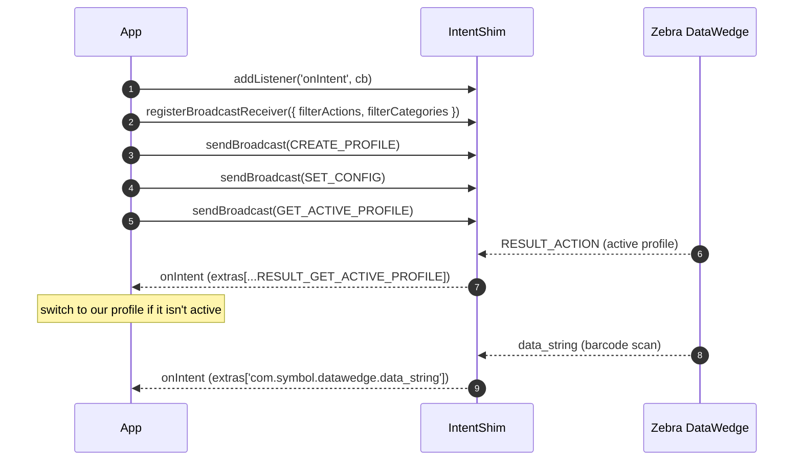

# Easystep2 DataWedge Plugin (Capacitor)

A Capacitor plugin for Android Intents that integrates with Zebra DataWedge.

> **v6.0.0 (breaking):** the public API was tightened to match the native
> implementation. `packageExists` now takes `{ packageName }` (was a bare string),
> the never-implemented `setDebugMode` was removed, and intents are delivered through
> the typed `addListener('onIntent', …)` event. See [Migration from 5.x](#migration-from-5x).

## Installation

```bash
npm install com-easystep2-datawedge-plugin-intent-capacitor
npx cap sync
```

## Platforms

- Android

## How it works

A typical DataWedge setup registers the listener first, then issues profile commands.
Result broadcasts (active profile, scans) arrive back through the `onIntent` event:



## Usage

```typescript
import { IntentShim } from 'com-easystep2-datawedge-plugin-intent-capacitor';

async function setupDataWedge() {
  // 1. Listen for delivered intents (DataWedge scans + API results) FIRST, so no
  //    result broadcast from the commands below is missed.
  await IntentShim.addListener('onIntent', (intent) => {
    const extras = intent.extras ?? {};

    // Barcode scans
    if (extras['com.symbol.datawedge.data_string']) {
      console.log('Scanned barcode:', extras['com.symbol.datawedge.data_string']);
    }

    // DataWedge API results (e.g. active profile)
    if (extras['com.symbol.datawedge.api.RESULT_GET_ACTIVE_PROFILE']) {
      console.log('Active profile:', extras['com.symbol.datawedge.api.RESULT_GET_ACTIVE_PROFILE']);
    }
  });

  // 2. Register the broadcast receiver for the actions you care about.
  await IntentShim.registerBroadcastReceiver({
    filterActions: [
      'com.symbol.datawedge.data_string',
      'com.symbol.datawedge.api.RESULT_ACTION',
    ],
    filterCategories: ['android.intent.category.DEFAULT'],
  });

  // 3. Create + configure a DataWedge profile via the API action.
  await IntentShim.sendBroadcast({
    action: 'com.symbol.datawedge.api.ACTION',
    extras: { 'com.symbol.datawedge.api.CREATE_PROFILE': 'MyProfile' },
  });
}
```

## API

### IntentShim

#### Methods

- `registerBroadcastReceiver(options: BroadcastReceiverOptions): Promise<void>`
- `unregisterBroadcastReceiver(): Promise<void>`
- `sendBroadcast(options: IntentOptions): Promise<void>`
- `startActivity(options: IntentOptions): Promise<void>`
- `getIntent(): Promise<IntentResult>`
- `startActivityForResult(options: IntentOptions & { requestCode: number }): Promise<IntentResult>`
- `sendResult(options: { extras?: any; resultCode?: number }): Promise<void>`
- `packageExists(options: { packageName: string }): Promise<{ exists: boolean }>`
- `removeAllListeners(): Promise<void>`

#### Events

- `addListener('onIntent', (intent: IntentResult) => void): Promise<PluginListenerHandle>`

  Fired for every intent delivered to a registered broadcast receiver (DataWedge
  scans and API `RESULT_ACTION` broadcasts).

#### Types

```typescript
interface IntentOptions {
  action?: string;
  url?: string;
  type?: string;
  package?: string;
  component?: { package: string; class: string };
  flags?: number[];
  extras?: Record<string, any>;
}

interface BroadcastReceiverOptions {
  filterActions: string[];
  filterCategories?: string[];
  filterDataSchemes?: string[];
}

interface IntentResult {
  action: string;
  data: string;
  type: string;
  package?: string;
  component?: string;
  extras: any;
  requestCode?: number;
  resultCode?: number;
}
```

#### Constants

```typescript
import { 
  ACTION_SEND, ACTION_VIEW, EXTRA_TEXT, EXTRA_SUBJECT, EXTRA_STREAM, 
  EXTRA_EMAIL, ACTION_CALL, ACTION_SENDTO, ACTION_GET_CONTENT, ACTION_PICK 
} from 'com-easystep2-datawedge-plugin-intent-capacitor';
```

## Migration from 5.x

- `packageExists('com.foo')` → `packageExists({ packageName: 'com.foo' })`.
  (The old string form never worked — the native side always read an options key.)
- `setDebugMode(...)` was **removed**; it had no native implementation and threw
  "not implemented" on device. Use `console` logging / logcat instead.
- Intent delivery is via `addListener('onIntent', …)`. The previous `onIntent(callback)`
  method form, and the `broadcastReceived` / `onActivityResult` events shown in older
  docs, were never implemented natively.

## Zebra DataWedge Integration

For detailed information about integrating with Zebra DataWedge, please refer to:
- [Official Zebra DataWedge API Documentation](https://techdocs.zebra.com/datawedge/latest/guide/api/)
- [DataWedge Intent API sample](https://github.com/ZebraDevs/DataWedge-API-Exerciser)

## License

MIT
