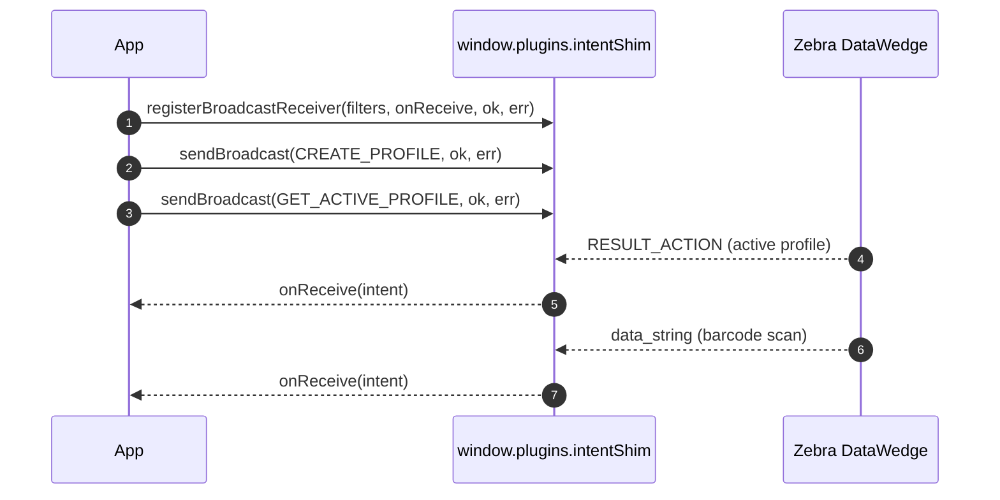

# Easystep2 DataWedge Plugin (Cordova)

A Cordova plugin for Android Intents that integrates with Zebra DataWedge.

> The Cordova package is maintained on its own **4.x** line, in parallel with the
> Capacitor package (**6.x**). The two share the same DataWedge feature set; only the
> JavaScript calling convention differs (Cordova uses positional success/error
> callbacks, Capacitor uses promises + `addListener`).

## Installation

```bash
cordova plugin add com-easystep2-datawedge-plugin-intent-cordova
```

## Platforms

- Android

## How it works

The Cordova API uses positional success/error callbacks. You register a broadcast
receiver, and its callback fires for every matching intent (scans, API results):



## Usage

```javascript
document.addEventListener('deviceready', onDeviceReady, false);

function onDeviceReady() {
    // Register for barcode scan broadcast
    window.plugins.intentShim.registerBroadcastReceiver({
        filterActions: ['com.symbol.datawedge.api.RESULT_ACTION']
    }, barcodeReceived, registerSuccess, registerError);

    // Configure DataWedge profile
    configureDataWedgeProfile();
}

function barcodeReceived(intent) {
    if (intent.extras && intent.extras['com.symbol.datawedge.data_string']) {
        const barcodeData = intent.extras['com.symbol.datawedge.data_string'];
        console.log('Scanned barcode:', barcodeData);
    }
}

function configureDataWedgeProfile() {
    window.plugins.intentShim.sendBroadcast({
        action: 'com.symbol.datawedge.api.ACTION',
        extras: {
            'com.symbol.datawedge.api.CREATE_PROFILE': 'MyProfile',
            'com.symbol.datawedge.api.PROFILE_CONFIG': {
                'PLUGIN_CONFIG': {
                    'BARCODE_PLUGIN': {
                        'SCANNER_SELECTION': 'auto',
                        'SCANNER_INPUT_ENABLED': true
                    }
                },
                'APP_LIST': [{
                    'PACKAGE_NAME': 'io.cordova.myapp', // Replace with your app's package name
                    'ACTIVITY_LIST': ['*']
                }]
            }
        }
    }, sendSuccess, sendError);
}

function registerSuccess() {
    console.log('Broadcast receiver registered successfully');
}

function registerError(error) {
    console.error('Error registering broadcast receiver:', error);
}

function sendSuccess() {
    console.log('Broadcast sent successfully');
}

function sendError(error) {
    console.error('Error sending broadcast:', error);
}
```

## API

### window.plugins.intentShim

#### Methods

- `registerBroadcastReceiver(options, onBroadcastReceived, onSuccess, onError)`
- `unregisterBroadcastReceiver(onSuccess, onError)`
- `sendBroadcast(options, onSuccess, onError)`
- `startActivity(options, onSuccess, onError)`
- `getIntent(onSuccess, onError)`
- `startActivityForResult(options, onSuccess, onError)`
- `sendResult(options, onSuccess, onError)`
- `packageExists(packageName, onSuccess, onError)`
- `onIntent(callback)`

#### Constants

```javascript
// Intent actions
var ACTION_SEND = window.plugins.intentShim.ACTION_SEND;
var ACTION_VIEW = window.plugins.intentShim.ACTION_VIEW;
var ACTION_CALL = window.plugins.intentShim.ACTION_CALL;
var ACTION_SENDTO = window.plugins.intentShim.ACTION_SENDTO;
var ACTION_GET_CONTENT = window.plugins.intentShim.ACTION_GET_CONTENT;
var ACTION_PICK = window.plugins.intentShim.ACTION_PICK;

// Intent extras
var EXTRA_TEXT = window.plugins.intentShim.EXTRA_TEXT;
var EXTRA_SUBJECT = window.plugins.intentShim.EXTRA_SUBJECT;
var EXTRA_STREAM = window.plugins.intentShim.EXTRA_STREAM;
var EXTRA_EMAIL = window.plugins.intentShim.EXTRA_EMAIL;
```

## Zebra DataWedge Integration

For detailed information about integrating with Zebra DataWedge, please refer to:
- [Official Zebra DataWedge API Documentation](https://techdocs.zebra.com/datawedge/latest/guide/api/)
- [DataWedge Intent API sample](https://github.com/ZebraDevs/DataWedge-API-Exerciser)

## License

MIT
